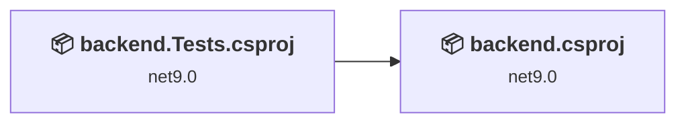
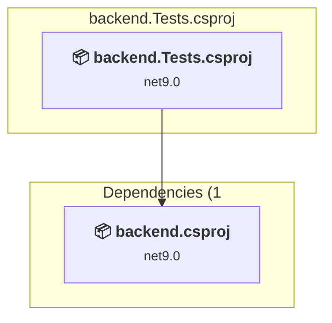
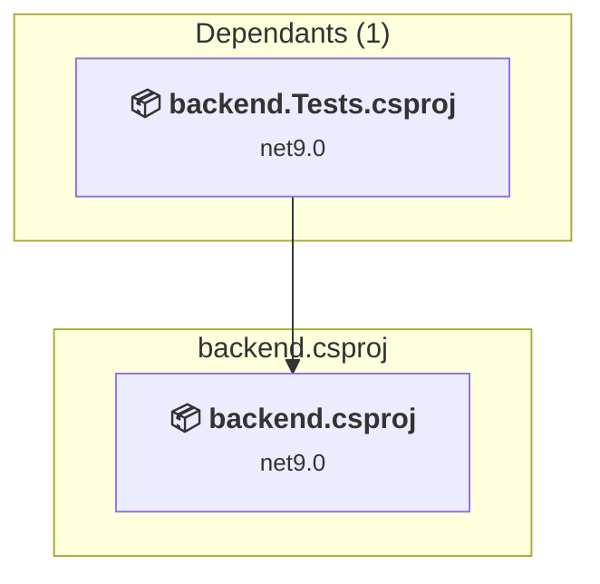

# Projects and dependencies analysis

This document provides a comprehensive overview of the projects and their dependencies in the context of upgrading to .NETCoreApp,Version=v10.0.

## Table of Contents

- [Executive Summary](#executive-Summary)
  - [Highlevel Metrics](#highlevel-metrics)
  - [Projects Compatibility](#projects-compatibility)
  - [Package Compatibility](#package-compatibility)
  - [API Compatibility](#api-compatibility)
- [Aggregate NuGet packages details](#aggregate-nuget-packages-details)
- [Top API Migration Challenges](#top-api-migration-challenges)
  - [Technologies and Features](#technologies-and-features)
  - [Most Frequent API Issues](#most-frequent-api-issues)
- [Projects Relationship Graph](#projects-relationship-graph)
- [Project Details](#project-details)

  - [backend.Tests\backend.Tests.csproj](#backendtestsbackendtestscsproj)
  - [backend\backend.csproj](#backendbackendcsproj)

## Executive Summary

### Highlevel Metrics

| Metric | Count | Status |
| :--- | :---: | :--- |
| Total Projects | 2 | All require upgrade |
| Total NuGet Packages | 21 | 5 need upgrade |
| Total Code Files | 57 |  |
| Total Code Files with Incidents | 3 |  |
| Total Lines of Code | 4149 |  |
| Total Number of Issues | 17 |  |
| Estimated LOC to modify | 10+ | at least 0,2% of codebase |

### Projects Compatibility

| Project | Target Framework | Difficulty | Package Issues | API Issues | Est. LOC Impact | Description |
| :--- | :---: | :---: | :---: | :---: | :---: | :--- |
| [backend.Tests\backend.Tests.csproj](#backendtestsbackendtestscsproj) | net9.0 | 🟢 Low | 2 | 10 | 10+ | DotNetCoreApp, Sdk Style = True |
| [backend\backend.csproj](#backendbackendcsproj) | net9.0 | 🟢 Low | 3 | 0 |  | AspNetCore, Sdk Style = True |

### Package Compatibility

| Status | Count | Percentage |
| :--- | :---: | :---: |
| ✅ Compatible | 16 | 76,2% |
| ⚠️ Incompatible | 3 | 14,3% |
| 🔄 Upgrade Recommended | 2 | 9,5% |
| ***Total NuGet Packages*** | ***21*** | ***100%*** |

### API Compatibility

| Category | Count | Impact |
| :--- | :---: | :--- |
| 🔴 Binary Incompatible | 0 | High - Require code changes |
| 🟡 Source Incompatible | 0 | Medium - Needs re-compilation and potential conflicting API error fixing |
| 🔵 Behavioral change | 10 | Low - Behavioral changes that may require testing at runtime |
| ✅ Compatible | 5627 |  |
| ***Total APIs Analyzed*** | ***5637*** |  |

## Aggregate NuGet packages details

| Package | Current Version | Suggested Version | Projects | Description |
| :--- | :---: | :---: | :--- | :--- |
| coverlet.collector | 6.0.0 |  | [backend.Tests.csproj](#backendtestsbackendtestscsproj) | ✅Compatible |
| FluentAssertions | 6.12.0 |  | [backend.Tests.csproj](#backendtestsbackendtestscsproj) | ✅Compatible |
| MediatR | 14.1.0 |  | [backend.csproj](#backendbackendcsproj) | ✅Compatible |
| MediatR.Extensions.Microsoft.DependencyInjection | 11.1.0 |  | [backend.csproj](#backendbackendcsproj) | ⚠️El paquete NuGet está en desuso |
| Microsoft.AspNetCore.Mvc.Testing | 9.0.8 | 10.0.3 | [backend.Tests.csproj](#backendtestsbackendtestscsproj) | Se recomienda actualizar el paquete NuGet |
| Microsoft.AspNetCore.Mvc.Versioning | 5.1.0 |  | [backend.csproj](#backendbackendcsproj) | ⚠️El paquete NuGet está en desuso |
| Microsoft.AspNetCore.Mvc.Versioning.ApiExplorer | 5.1.0 |  | [backend.csproj](#backendbackendcsproj) | ⚠️El paquete NuGet está en desuso |
| Microsoft.AspNetCore.OpenApi | 10.0.3 |  | [backend.csproj](#backendbackendcsproj) | ✅Compatible |
| Microsoft.EntityFrameworkCore.InMemory | 9.0.8 | 10.0.3 | [backend.Tests.csproj](#backendtestsbackendtestscsproj) | Se recomienda actualizar el paquete NuGet |
| Microsoft.NET.Test.Sdk | 17.8.0 |  | [backend.Tests.csproj](#backendtestsbackendtestscsproj) | ✅Compatible |
| Moq | 4.20.69 |  | [backend.Tests.csproj](#backendtestsbackendtestscsproj) | ✅Compatible |
| Serilog.AspNetCore | 10.0.0 |  | [backend.csproj](#backendbackendcsproj) | ✅Compatible |
| Serilog.Enrichers.Environment | 3.0.1 |  | [backend.csproj](#backendbackendcsproj) | ✅Compatible |
| Serilog.Enrichers.Process | 3.0.0 |  | [backend.csproj](#backendbackendcsproj) | ✅Compatible |
| Serilog.Enrichers.Thread | 4.0.0 |  | [backend.csproj](#backendbackendcsproj) | ✅Compatible |
| Serilog.Settings.Configuration | 10.0.0 |  | [backend.csproj](#backendbackendcsproj) | ✅Compatible |
| Serilog.Sinks.Console | 6.1.1 |  | [backend.csproj](#backendbackendcsproj) | ✅Compatible |
| Serilog.Sinks.File | 7.0.0 |  | [backend.csproj](#backendbackendcsproj) | ✅Compatible |
| Swashbuckle.AspNetCore | 10.1.4 |  | [backend.csproj](#backendbackendcsproj) | ✅Compatible |
| xunit | 2.6.1 |  | [backend.Tests.csproj](#backendtestsbackendtestscsproj) | ✅Compatible |
| xunit.runner.visualstudio | 2.5.3 |  | [backend.Tests.csproj](#backendtestsbackendtestscsproj) | ✅Compatible |

## Top API Migration Challenges

### Technologies and Features

| Technology | Issues | Percentage | Migration Path |
| :--- | :---: | :---: | :--- |

### Most Frequent API Issues

| API | Count | Percentage | Category |
| :--- | :---: | :---: | :--- |
| T:System.Net.Http.HttpContent | 10 | 100,0% | Behavioral Change |

## Projects Relationship Graph

Legend:
📦 SDK-style project
⚙️ Classic project

## Project Details

### backend.Tests\backend.Tests.csproj

#### Project Info

- **Current Target Framework:** net9.0
- **Proposed Target Framework:** net10.0
- **SDK-style**: True
- **Project Kind:** DotNetCoreApp
- **Dependencies**: 1
- **Dependants**: 0
- **Number of Files**: 21
- **Number of Files with Incidents**: 2
- **Lines of Code**: 2187
- **Estimated LOC to modify**: 10+ (at least 0,5% of the project)

#### Dependency Graph

Legend:
📦 SDK-style project
⚙️ Classic project

### API Compatibility

| Category | Count | Impact |
| :--- | :---: | :--- |
| 🔴 Binary Incompatible | 0 | High - Require code changes |
| 🟡 Source Incompatible | 0 | Medium - Needs re-compilation and potential conflicting API error fixing |
| 🔵 Behavioral change | 10 | Low - Behavioral changes that may require testing at runtime |
| ✅ Compatible | 3552 |  |
| ***Total APIs Analyzed*** | ***3562*** |  |

### backend\backend.csproj

#### Project Info

- **Current Target Framework:** net9.0
- **Proposed Target Framework:** net10.0
- **SDK-style**: True
- **Project Kind:** AspNetCore
- **Dependencies**: 0
- **Dependants**: 1
- **Number of Files**: 40
- **Number of Files with Incidents**: 1
- **Lines of Code**: 1962
- **Estimated LOC to modify**: 0+ (at least 0,0% of the project)

#### Dependency Graph

Legend:
📦 SDK-style project
⚙️ Classic project

### API Compatibility

| Category | Count | Impact |
| :--- | :---: | :--- |
| 🔴 Binary Incompatible | 0 | High - Require code changes |
| 🟡 Source Incompatible | 0 | Medium - Needs re-compilation and potential conflicting API error fixing |
| 🔵 Behavioral change | 0 | Low - Behavioral changes that may require testing at runtime |
| ✅ Compatible | 2075 |  |
| ***Total APIs Analyzed*** | ***2075*** |  |

